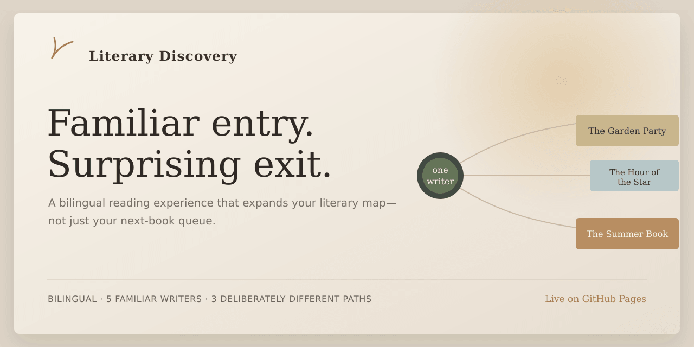

# Literary Discovery

**A bilingual reading experience that expands your literary map—not just your next-book queue.**

[Try the English demo](https://echoguo92.github.io/literary-discovery/?lang=en) · [体验中文版](https://echoguo92.github.io/literary-discovery/?lang=zh)



> Familiar entry. Surprising exit.

Literary Discovery begins with one writer already on the reader's mind, then offers exactly three books that open deliberately different ways forward. Instead of maximizing similarity or popularity, it asks a harder question:

> How can a reader leave the literary map they already know without turning discovery into a syllabus?

## Try it in 60 seconds

1. Choose Virginia Woolf, Jane Austen, Anton Chekhov, Gabriel García Márquez, or Toni Morrison.
2. Move through three recommendations rather than a long ranked list.
3. Read what makes each book worth opening and why it belongs in this path.
4. Keep a book in your local Library and, if you want, add an open-ended reading note.

No account or setup is required. The Chinese and English editions share the same browser-local Library.

## What this project demonstrates

- **Product discovery** — turning a real reader frustration into a focused product problem.
- **Recommendation design** — composing a set for controlled taste expansion rather than “more of what you already like.”
- **Editorial systems** — separating canonical book value from the reason a book is recommended from a particular writer.
- **AI product judgment** — using AI during research, drafting, evaluation, and prototyping without exposing unstable runtime generation to readers.
- **Reliability design** — source-checking historical claims, version-locking approved content, and serving deterministic fallbacks.
- **End-to-end delivery** — bilingual copy, responsive interaction, reader testing, iterative UX fixes, and a public GitHub Pages release.

## Product at a glance

| | Current public demo |
|---|---|
| Entry points | 5 familiar writers |
| Recommendation composition | 3 deliberately different paths per writer |
| Published recommendation edges | 15 |
| Unique recommendation books | 14 |
| Languages | Chinese and English |
| Reader state | Browser `localStorage` only |
| Runtime AI API | None |
| Required incremental cost | **$0** |

## Recommendation design

Every three-book set balances three forces:

- **Personal bridge** — why the move makes sense from the reader's current writer.
- **Intrinsic pull** — whether the book is compelling even without that starting point.
- **Expansion value** — whether it meaningfully widens the reader's literary map.

Internally, the three positions play different roles—close continuity, adjacent expansion, and bolder exploration—but those labels are never shown in the product. Readers encounter the logic through the books themselves and the edge-specific **“与你的联系 / Why it belongs here”** explanation.

The same book can therefore appear from two writers for genuinely different reasons. That relationship copy belongs to the recommendation edge, not to the book object.

See [`evals/recommendation-rubric.json`](./evals/recommendation-rubric.json).

## Why the published demo is deterministic

The project uses AI-assisted research, candidate generation, drafting, evaluation, and prototyping. The public browser experience does **not** ask a model to generate final recommendation copy at runtime.

```text
AI-assisted research / candidate generation / drafting
                         ↓
source check + editorial review + recommendation-set eval
                         ↓
                 versioned content objects
                         ↓
              deterministic frontend render
```

This boundary addresses a product risk observed during development: without gates and versioning, long AI-assisted content workflows can drift, repeat modules, overstate literary relationships, or improve one case at the expense of the global product architecture.

This is not a rejection of AI. It is a reliability architecture.

See [`docs/content-stability.md`](./docs/content-stability.md).

## Content and reliability architecture

- `data/books.json` — canonical book presentation; no recommendation-specific copy.
- `data/writers.json` — concise Writer Signal and Context.
- `data/recommendation_paths.json` — writer → book edges and their relationship explanations.
- `data/sources.json` — research and source registry.
- `evals/recommendation-rubric.json` — candidate- and set-level evaluation criteria.
- `scripts/validate_content.py` — structural content validation.

Historical relationships and editorial judgments are kept distinct:

- `HISTORICAL_CONNECTION` requires a source.
- `EDITORIAL_BRIDGE` is a recommendation judgment and is never presented as historical fact.

The reader-approved Home copy, writer portraits, and book hero art are all versioned locally. The site has no external runtime image dependency.

See [`docs/product-principles.md`](./docs/product-principles.md) and [`docs/content-reliability.md`](./docs/content-reliability.md).

## Current product scope

- Canonical Home recommendation experience
- Informational Writer Snapshots
- Local Want to Read / Read Library
- Open-ended reading notes
- Chinese / English switch with shareable language URLs
- Responsive desktop and mobile layouts
- No account, backend, database, analytics, payment, or runtime AI API

The absence of a writer graph, social layer, and generative chat is intentional. This version keeps Home—Encounter + Decision—as the core product surface.

## Run locally

The app is a no-build static site. Because it loads local JSON with `fetch`, serve the repository with any static server:

```bash
python3 -m http.server 8000
```

Then open `http://localhost:8000`.

## 中文说明

Literary Discovery 不是一个“猜你喜欢”的书单工具。它从一位读者已经想到的作家出发，只提供三本承担不同扩展作用的书：保留足够的联系，同时主动改变地域、时代、形式、声音或文学传统。

[直接体验中文版](https://echoguo92.github.io/literary-discovery/?lang=zh)

这个项目采用 AI 辅助研究、内容生产、评估与原型开发，但公开 Demo 不在运行时直接生成最终推荐文案。历史关系经过来源校验，读者确认过的内容以版本化数据稳定呈现。这个限制本身也是产品判断的一部分：**AI 产品的价值不仅在于生成能力，也在于如何设计可靠的生成边界。**

当前版本保持 `$0` 新增成本：不需要 OpenAI API、数据库、付费托管或自定义域名。
